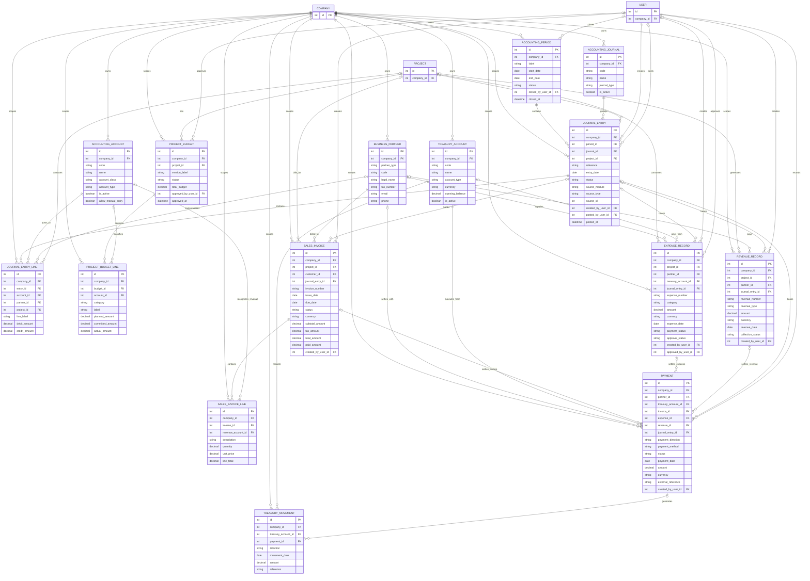

# T-ERP - ERD Cible Stock et Finance

Note de lecture :
ce document decrit l'ERD cible des domaines stock et finance. Pour l'etat reel du socle implemente et la matrice de source de verite finance consolidee a la fin de `E4.1.1` au `2026-04-10`, voir aussi [Reference du socle actuel](reference-socle-actuel.md).

Documents lies :

- [Cahier des charges fonctionnel](cahier-des-charges-fonctionnel.md)
- [Module Gestion de Stock](module-gestion-stock-btp.md)
- [Module Gestion Comptable et Financiere](module-gestion-comptable-financiere.md)
- [ERD base de donnees actuel](erd-base-de-donnees.md)
- [Contrats API Stock + Finance](contrats-api-stock-finance.md)

## 1. Objet

Ce document derive un **ERD cible** pour les modules :

- gestion de stock BTP
- gestion comptable et financiere

Il complete l'ERD de base deja present dans le projet en couvrant les entites manquantes pour supporter :

- les flux de stock documentes et valides
- les inventaires
- la reservation et l'allocation par projet
- la comptabilite generale et analytique
- la tresorerie
- la facturation et les paiements

## 2. Principes de modelisation

### 2.1 Multi-tenant

Toutes les tables metier portent `company_id` pour garantir :

- l'isolation stricte des donnees
- la supervision par tenant
- la compatibilite avec le mecanisme `X-Tenant-ID`

### 2.2 Compatibilite avec l'existant

Les tables deja presentes dans le backend et conservees comme socle sont :

- `stock_locations`
- `inventory_items`
- `stock_movements`
- `project_stock_allocations`
- `projects`
- `users`
- `companies`

Les nouvelles tables proposees ci-dessous etendent ce socle sans casser la structure actuelle.

### 2.3 Separation metier

Le decoupage recommande pour les futurs modeles est :

- `inventory.py` pour les ressources de stock
- `finance.py` pour les ressources comptables et financieres
- reutilisation des references existantes `companies`, `users`, `projects`

## 3. Vue d'ensemble des nouvelles familles d'entites

### 3.1 Stock

Entites cibles :

- `stock_locations`
- `inventory_items`
- `stock_documents`
- `stock_document_lines`
- `stock_movements`
- `stock_reservations`
- `project_stock_allocations`
- `stock_count_sessions`
- `stock_count_lines`

### 3.2 Finance

Entites cibles :

- `business_partners`
- `accounting_periods`
- `accounting_journals`
- `accounting_accounts`
- `journal_entries`
- `journal_entry_lines`
- `treasury_accounts`
- `treasury_movements`
- `project_budgets`
- `project_budget_lines`
- `expense_records`
- `revenue_records`
- `sales_invoices`
- `sales_invoice_lines`
- `payments`

## 4. Diagramme ERD - Stock

```mermaid
erDiagram
    COMPANY {
        int id PK
    }

    USER {
        int id PK
        int company_id FK
    }

    PROJECT {
        int id PK
        int company_id FK
    }

    BUSINESS_PARTNER {
        int id PK
        int company_id FK
        string partner_type
        string code
        string legal_name
    }

    STOCK_LOCATION {
        int id PK
        int company_id FK
        string code
        string name
        string location_type
        int project_id FK
        int manager_user_id FK
        boolean is_active
    }

    INVENTORY_ITEM {
        int id PK
        int company_id FK
        string sku
        string name
        string item_type
        string category
        string unit
        decimal min_threshold
        decimal max_threshold
        decimal average_unit_cost
        decimal last_purchase_price
        int default_supplier_id FK
        datetime deleted_at
    }

    STOCK_DOCUMENT {
        int id PK
        int company_id FK
        string document_type
        string status
        date document_date
        int source_location_id FK
        int destination_location_id FK
        int project_id FK
        int partner_id FK
        string reference
        string external_reference
        string reason_code
        int requested_by_user_id FK
        int validated_by_user_id FK
        datetime validated_at
    }

    STOCK_DOCUMENT_LINE {
        int id PK
        int company_id FK
        int document_id FK
        int item_id FK
        decimal quantity
        decimal unit_cost
        decimal total_cost
        string task_reference
    }

    STOCK_MOVEMENT {
        int id PK
        int company_id FK
        int item_id FK
        int document_id FK
        int document_line_id FK
        int from_location_id FK
        int to_location_id FK
        string movement_type
        decimal quantity
        decimal unit_cost
        decimal total_cost
        int performed_by_user_id FK
        string reference
        datetime occurred_at
    }

    STOCK_RESERVATION {
        int id PK
        int company_id FK
        int project_id FK
        int item_id FK
        int location_id FK
        decimal quantity_reserved
        string status
        datetime expires_at
        int created_by_user_id FK
    }

    PROJECT_STOCK_ALLOCATION {
        int id PK
        int company_id FK
        int project_id FK
        int item_id FK
        int stock_movement_id FK
        decimal quantity_allocated
        int allocated_by_user_id FK
    }

    STOCK_COUNT_SESSION {
        int id PK
        int company_id FK
        int location_id FK
        string scope_type
        string status
        date planned_at
        datetime counted_at
        int launched_by_user_id FK
        int approved_by_user_id FK
    }

    STOCK_COUNT_LINE {
        int id PK
        int company_id FK
        int session_id FK
        int item_id FK
        decimal theoretical_qty
        decimal counted_qty
        decimal variance_qty
        int counted_by_user_id FK
        int adjustment_document_id FK
    }

    COMPANY ||--o{ STOCK_LOCATION : owns
    COMPANY ||--o{ INVENTORY_ITEM : owns
    COMPANY ||--o{ STOCK_DOCUMENT : owns
    COMPANY ||--o{ STOCK_DOCUMENT_LINE : scopes
    COMPANY ||--o{ STOCK_MOVEMENT : scopes
    COMPANY ||--o{ STOCK_RESERVATION : scopes
    COMPANY ||--o{ PROJECT_STOCK_ALLOCATION : scopes
    COMPANY ||--o{ STOCK_COUNT_SESSION : scopes
    COMPANY ||--o{ STOCK_COUNT_LINE : scopes
    COMPANY ||--o{ BUSINESS_PARTNER : owns

    PROJECT o|--o{ STOCK_LOCATION : site_stock
    USER o|--o{ STOCK_LOCATION : manages
    BUSINESS_PARTNER o|--o{ INVENTORY_ITEM : defaults

    STOCK_DOCUMENT ||--o{ STOCK_DOCUMENT_LINE : contains
    INVENTORY_ITEM ||--o{ STOCK_DOCUMENT_LINE : references
    STOCK_DOCUMENT ||--o{ STOCK_MOVEMENT : generates
    STOCK_DOCUMENT_LINE o|--o{ STOCK_MOVEMENT : traces
    INVENTORY_ITEM ||--o{ STOCK_MOVEMENT : moves
    STOCK_LOCATION o|--o{ STOCK_MOVEMENT : from
    STOCK_LOCATION o|--o{ STOCK_MOVEMENT : to
    USER ||--o{ STOCK_MOVEMENT : performs

    PROJECT ||--o{ STOCK_DOCUMENT : consumes_for
    BUSINESS_PARTNER o|--o{ STOCK_DOCUMENT : supplies
    USER ||--o{ STOCK_DOCUMENT : requests
    USER o|--o{ STOCK_DOCUMENT : validates

    PROJECT ||--o{ STOCK_RESERVATION : reserves
    INVENTORY_ITEM ||--o{ STOCK_RESERVATION : reserves
    STOCK_LOCATION ||--o{ STOCK_RESERVATION : reserves_from
    USER ||--o{ STOCK_RESERVATION : creates

    PROJECT ||--o{ PROJECT_STOCK_ALLOCATION : receives
    INVENTORY_ITEM ||--o{ PROJECT_STOCK_ALLOCATION : allocates
    STOCK_MOVEMENT o|--o{ PROJECT_STOCK_ALLOCATION : proves
    USER ||--o{ PROJECT_STOCK_ALLOCATION : allocates_by

    STOCK_LOCATION ||--o{ STOCK_COUNT_SESSION : counts
    USER ||--o{ STOCK_COUNT_SESSION : launches
    USER o|--o{ STOCK_COUNT_SESSION : approves
    STOCK_COUNT_SESSION ||--o{ STOCK_COUNT_LINE : contains
    INVENTORY_ITEM ||--o{ STOCK_COUNT_LINE : counts
    USER ||--o{ STOCK_COUNT_LINE : counts_by
    STOCK_DOCUMENT o|--o{ STOCK_COUNT_LINE : adjusts_with
```

## 5. Dictionnaire cible - Stock

### `stock_locations`

Role :
emplacements physiques ou logiques de stockage.

Champs structurants :

- `location_type` : `warehouse`, `depot`, `site`, `quarantine`
- `project_id` nullable pour les stocks chantier
- `manager_user_id` nullable pour le responsable
- `is_active` pour fermer un emplacement sans supprimer son historique

Contraintes recommandees :

- unicite `(company_id, code)`
- check sur `location_type`

### `inventory_items`

Role :
catalogue maitre des articles.

Extensions recommandees par rapport au modele actuel :

- `item_type` : `material`, `equipment`, `consumable`
- `max_threshold`
- `average_unit_cost`
- `last_purchase_price`
- `default_supplier_id`

Contraintes recommandees :

- unicite `(company_id, sku)`
- `min_threshold >= 0`
- `max_threshold >= min_threshold`

### `stock_documents`

Role :
entete metier des flux de stock. Cette table porte le workflow de validation.

Types cibles :

- `receipt`
- `issue`
- `transfer`
- `adjustment`
- `count_adjustment`

Statuts recommandes :

- `draft`
- `pending_validation`
- `validated`
- `cancelled`

Benefice :
separer le document metier du mouvement physique, afin de tracer demande, validation et execution.

### `stock_document_lines`

Role :
lignes articles d'un document de stock.

Champs cles :

- `document_id`
- `item_id`
- `quantity`
- `unit_cost`
- `total_cost`

Contrainte recommandee :

- `quantity > 0`

### `stock_movements`

Role :
grand livre des mouvements reels de stock.

Remarque :
la table actuelle existe deja et peut devenir la couche definitive de tracabilite, alimentee par les documents valides.

Extensions recommandees :

- `document_id`
- `document_line_id`
- `unit_cost`
- `total_cost`
- `occurred_at`

### `stock_reservations`

Role :
quantites reservees avant sortie physique.

Statuts recommandes :

- `active`
- `released`
- `consumed`
- `expired`

### `project_stock_allocations`

Role :
rattachement formel d'une quantite a un projet, avec preuve par mouvement.

Compatibilite :
la table existe deja et peut etre enrichie avec `stock_movement_id`.

### `stock_count_sessions`

Role :
campagnes d'inventaire.

Statuts recommandes :

- `draft`
- `open`
- `counted`
- `approved`
- `cancelled`

### `stock_count_lines`

Role :
resultat article par article d'un inventaire.

Champs cles :

- `theoretical_qty`
- `counted_qty`
- `variance_qty`
- `adjustment_document_id`

## 6. Diagramme ERD - Finance



## 7. Dictionnaire cible - Finance

### `business_partners`

Role :
tiers metier mutualises pour les clients et fournisseurs.

Valeurs recommandees pour `partner_type` :

- `customer`
- `supplier`
- `both`

Contrainte recommandee :

- unicite `(company_id, code)`

### `accounting_periods`

Role :
periodes comptables avec possibilite de cloture.

Statuts recommandes :

- `open`
- `closing`
- `closed`

### `accounting_journals`

Role :
journaux comptables de saisie.

Types recommandes :

- `sales`
- `purchase`
- `cash`
- `bank`
- `misc`

### `accounting_accounts`

Role :
plan comptable configurable.

Contrainte recommandee :

- unicite `(company_id, code)`

### `journal_entries`

Role :
ecritures comptables tete.

Champs cles :

- `period_id`
- `journal_id`
- `entry_date`
- `source_module`
- `source_type`
- `source_id`

Statuts recommandes :

- `draft`
- `posted`
- `cancelled`

### `journal_entry_lines`

Role :
lignes debit / credit.

Regles critiques :

- une ligne porte soit un debit, soit un credit
- le total debit d'une ecriture doit egaler le total credit

### `treasury_accounts`

Role :
caisses, banques et comptes mobile money.

Types recommandes :

- `cash`
- `bank`
- `mobile_money`

### `treasury_movements`

Role :
historique des mouvements de tresorerie reels.

Valeurs recommandees pour `direction` :

- `incoming`
- `outgoing`
- `transfer`

### `project_budgets`

Role :
budget tete par projet et par version.

Statuts recommandes :

- `draft`
- `approved`
- `archived`

### `project_budget_lines`

Role :
ventilation du budget par categorie ou compte.

Champs cles :

- `planned_amount`
- `committed_amount`
- `actual_amount`

### `expense_records`

Role :
depenses operationnelles saisies par l'entreprise.

Statuts recommandes :

- `approval_status` : `draft`, `pending`, `approved`, `rejected`
- `payment_status` : `unpaid`, `partial`, `paid`

### `revenue_records`

Role :
recettes et encaissements identifies hors ou avant facturation.

Valeurs recommandees pour `collection_status` :

- `uncollected`
- `partial`
- `collected`

### `sales_invoices`

Role :
factures clients.

Statuts recommandes :

- `draft`
- `sent`
- `partial`
- `paid`
- `overdue`
- `cancelled`

Contraintes recommandees :

- unicite `(company_id, invoice_number)`

### `sales_invoice_lines`

Role :
lignes de facture avec compte de produit cible.

### `payments`

Role :
paiements entrants ou sortants.

Regles recommandees :

- `amount > 0`
- `payment_direction` parmi `incoming`, `outgoing`
- une seule reference metier principale parmi `invoice_id`, `expense_id`, `revenue_id`

## 8. Articulation Stock <-> Finance

Les deux modules doivent partager les points d'ancrage suivants :

- `business_partners` pour reutiliser clients et fournisseurs
- `projects` pour l'analytique chantier
- `users` pour la validation et l'audit
- valorisation des `stock_movements` dans le calcul du cout projet
- generation future d'ecritures comptables depuis les documents de stock valorises

Couplages recommandes :

- une entree fournisseur valorisee peut alimenter `expense_records`
- une sortie projet valorisee peut contribuer au `actual_amount` d'un `project_budget_line`
- une facture client peut generer un `journal_entry` et des `payments`

## 9. Mapping de mise en oeuvre recommande

### 9.1 Etape 1 - Extension du stock

Tables a ajouter en priorite :

- `stock_documents`
- `stock_document_lines`
- `stock_reservations`
- `stock_count_sessions`
- `stock_count_lines`

Tables existantes a enrichir :

- `inventory_items`
- `stock_locations`
- `stock_movements`
- `project_stock_allocations`

### 9.2 Etape 2 - Socle finance

Tables a creer :

- `business_partners`
- `accounting_periods`
- `accounting_journals`
- `accounting_accounts`
- `treasury_accounts`
- `project_budgets`
- `project_budget_lines`
- `expense_records`
- `revenue_records`
- `sales_invoices`
- `sales_invoice_lines`
- `payments`

### 9.3 Etape 3 - Comptabilite generale

Tables a creer :

- `journal_entries`
- `journal_entry_lines`
- `treasury_movements`

## 10. Conclusion

Cet ERD cible fournit une base directement exploitable pour :

- la redaction des modeles SQLAlchemy
- la preparation des migrations Alembic
- la definition des contrats API
- la construction des ecrans liste, detail et workflow

La suite logique est le contrat d'API correspondant :

- [Contrats API Stock + Finance](contrats-api-stock-finance.md)
